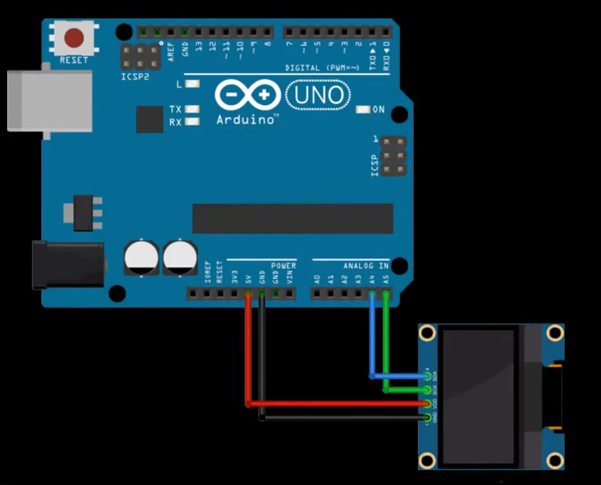

# codificador rotatorio
## Foto


---

## Código
````ino
int CLK = 2;
int DT = 3;
int contador =0;
int estadoActual;
int estadoAntes;
void setup()
{
  pinMode(CLK,INPUT);
  pinMode(DT,INPUT);
  Serial.begin(9600);
  estadoAntes = digitalRead(CLK);
}
void loop()
{
  estadoActual=digitalRead(CLK);
  if(estadoActual!=estadoAntes && estadoActual ==1)
  {
    if(digitalRead(DT)!=estadoActual)
    {
      contador++;
      Serial.println("contador:"+String(contador));

    }
    else
    {
      contador--;
      Serial.println("contador:"+String(contador));
    }
  }
  estadoAntes=estadoActual;
  delay(3);
}
````